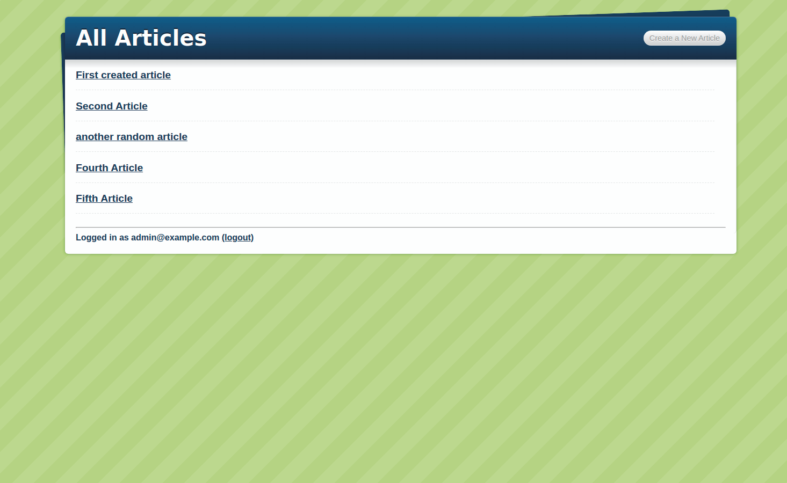

# Blog App

> In this project we will create a simple blog system as a pratice sandbox to learn the basics of Ruby on Rails including:

-Models, Views, and Controllers (MVC)
-Data Structures & Relationships
-Routing
-Migrations
-Views with forms, partials, and helpers
-RESTful design
-Adding gems for extra features

## Built With

- Ruby 2.6
- Ruby in Rails 5
- Git Flow
- SQL Lite 3

## Author

👤 **Mauricio Santos**

- Github: [@maosan132](https://github.com/maosan132)
- Twitter: [@maosan132](https://twitter.com/maosan132)
- Linkedin: [@maosan132](https://www.linkedin.com/in/mauricio-santos-a7292910/)

👤 **Yahir Cardona**

- Github: [@yahir91](https://github.com/yahir91)
- Twitter: [@YahirCardona3](https://twitter.com/YahirCardona3)
- Linkedin: [linkedin](https://www.linkedin.com/in/osmar-yahir-cardona-reyes-54b40b1a7/)

## 🤝 Contributing

Contributions, issues and feature requests are welcome!

Feel free to check the [issues page](issues/).

## Show your support

Give a ⭐️ if you like this project!

## Acknowledgments

- Hat tip to anyone whose code was used
- Inspiration
- etc

## 📝 License

This project is [MIT](lic.url) licensed.
